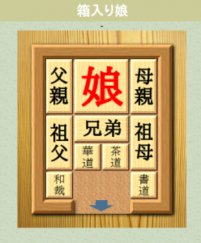
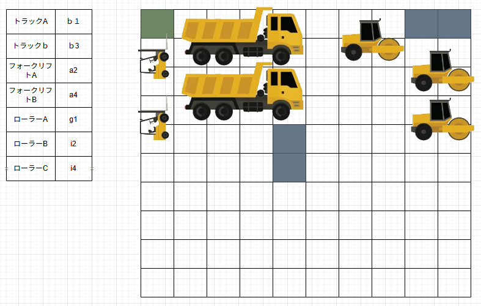

# 背景
- 建築業界の企業で、クレーン車やトレーラーなど様々な重機を多数保有している
- 各重機は大きいため、駐車スペースに詰めて停めている。
- 重機を動かすには、他の重機を一度動かさなければならない状態であり、それはさながら「箱入り娘」というパズルのような状態である。

# 課題
- 重機の出し入れに時間がかかる
- 目的の重機を取り出すためには、他の重機をどかす必要があり、気づけばどこにどの重機をおいたか分からなくなってしまう。さらに、重機は大型であるため、目視で全体を俯瞰的に確認することが難しい

# 対応案
1. 各重機にGPSやビーコンを取り付け、常にリアルタイムに位置情報を管理する
  - 長所
    - 特に手間なく、常に状況を把握できる
  - 短所
    - 全重機に取り付けるとなるとコストがかかる
    - GPSやビーコンの位置は数十メートル単位での把握となり、「駐車場内という限られた範囲で、どの重機がどの位置にあるのか」を把握する目的には不向き
2. ドローンによって空撮し、画像解析することで重機の位置を把握する
  - 長所
    - 駐車場内を俯瞰的に把握できる
  - 短所
    - ドローンが高額、画像解析のシステム構築も高額でランニングコストも高め
    - 定期的に撮影が必要、雨天・夜間には向かない
3. 先述のパズルのようなUIで、手動で管理するWEBアプリを開発する

  - 長所
    - 安価に開発できる、ランニングもほぼ無料
    - 作業員各自が、自分のスマホでいつでも手軽に確認・編集ができる
  - 短所
    - 手動管理しなければならない
